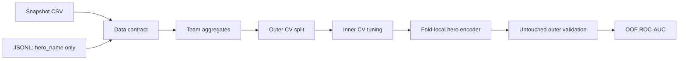

# Dota 2: честное предсказание победы Radiant

[](https://github.com/matevosovp/Dota-2-winner-prediction/actions/workflows/notebook-checks.yml)

Проект бинарной классификации: по данным, доступным в фиксированный момент матча, оценить вероятность победы команды **Radiant**. Репозиторий демонстрирует не только моделирование, но и инженерный контроль временных утечек, target encoding и честную оценку качества.

> [!IMPORTANT]
> Исторический ноутбук показывал ROC-AUC около `0.84`, но аудит обнаружил признаки из завершённого OpenDota-матча (`damage`, `towers_killed`, `roshans_killed` и другие). Они недоступны в момент прогноза. Поэтому старая метрика отозвана и не используется как результат проекта. Новая метрика должна быть получена повторным запуском leak-free пайплайна на исходном датасете, который распространяется отдельно.

## Что исправлено

- полный OpenDota JSONL больше не превращается автоматически в признаки;
- из JSONL разрешено извлекать только явно проверенные pre-game поля — по умолчанию `hero_name`;
- таблицы признаков и таргета объединяются только `one-to-one`, без молчаливой потери матчей;
- `match_id_hash`, таргет и известные post-match поля не попадают в модель;
- командные агрегаты строятся симметрично для Radiant и Dire;
- winrate героя кодируется со сглаживанием и исключением исхода текущего матча;
- подбор параметров выполняется во внутренних фолдах, качество измеряется только на внешних;
- ноутбук стал тонким интерфейсом к тестируемому Python-пакету;
- CI запускает Ruff, тесты, coverage gate, проверку notebook JSON и компиляцию.

## Протокол оценки



На каждом внешнем фолде:

1. внутренний `StratifiedKFold` выбирает гиперпараметры;
2. `HeroWinRateEncoder.fit_transform` рассчитывает train-значения без собственного исхода матча;
3. validation получает mapping, построенный только на train;
4. внешний fold используется один раз — для итогового OOF-прогноза.

Это устраняет две разные утечки: использование будущего состояния матча и попадание собственного target в hero winrate.

## Структура

```text
.
├── dota_predictor/
│   ├── data.py          # загрузка, schema checks и safe JSONL allowlist
│   ├── features.py      # командные признаки и leave-one-match-out encoder
│   ├── modeling.py      # Logistic Regression и CatBoost pipelines
│   ├── evaluation.py    # nested CV и OOF-метрики
│   └── train.py         # воспроизводимый CLI
├── tests/               # synthetic contract, leakage и CLI tests
├── Dota2winnerPrediction.ipynb
├── DATA.md
├── MODEL_CARD.md
└── requirements*.txt
```

## Быстрый старт

Требуется Python 3.12.

```bash
python -m venv .venv
source .venv/bin/activate
python -m pip install -r requirements-dev.txt
python -m pytest
```

На Windows окружение активируется командой:

```powershell
.venv\Scripts\Activate.ps1
```

Исходные данные разместите по инструкции из [DATA.md](DATA.md). Затем запустите интерпретируемый baseline:

```bash
python -m dota_predictor.train \
  --features train_features.csv \
  --targets train_targets.csv \
  --matches-jsonl "DOTA 2/train_matches.jsonl" \
  --model logistic \
  --output metrics/logistic-nested-cv.json
```

CatBoost-кандидат запускается заменой `--model logistic` на `--model catboost`. Он медленнее, поскольку каждый набор параметров оценивается только внутри nested CV.

Ноутбук можно открыть после установки окружения:

```bash
jupyter lab Dota2winnerPrediction.ipynb
```

## Почему ROC-AUC

Модель выдаёт вероятность победы, а не только класс. ROC-AUC оценивает качество ранжирования матчей независимо от выбранного порога. В отчёте сохраняются:

- ROC-AUC каждого внешнего фолда;
- среднее и стандартное отклонение;
- единый OOF ROC-AUC;
- параметры, выбранные отдельно внутри каждого внешнего фолда.

Один итоговый holdout не подменяется средним score после многократного подбора на тех же данных.

## Ограничения

- датасет не публикуется в Git и должен быть получен у правообладателя;
- подтверждённая leak-free метрика появится только после повторного запуска на исходных данных;
- модель не учитывает изменение патчей, меты, состава героев и поведения игроков во времени;
- для production-проверки нужна временная выборка из более позднего игрового периода и анализ калибровки вероятностей;
- это исследовательский проект, а не сервис для ставок.

Подробные границы применения описаны в [MODEL_CARD.md](MODEL_CARD.md).

## Командный вклад

- **Павел Матевосов — 50%:** обучение и сравнение моделей, feature engineering, подбор гиперпараметров;
- **Юлия Ефремова — 50%:** EDA, визуализации, интерпретация результатов и выводы.
